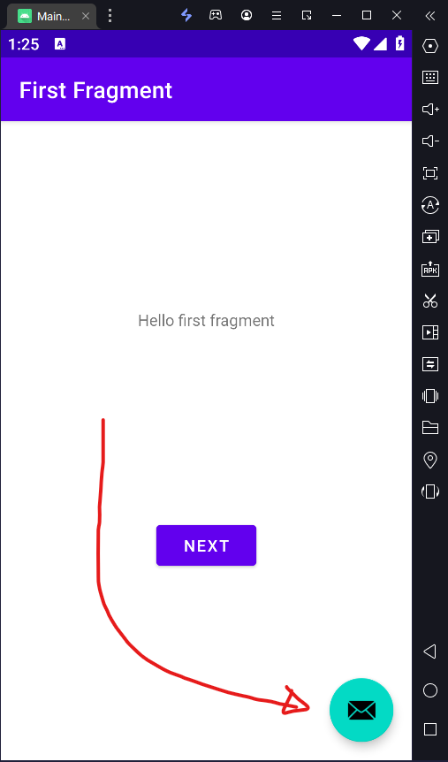

# Unity Ads Implementation

Dummy application to demonstrate the basic usage of Unity Ads SDK for Android, all you need is an account on 
[Unity](https://dashboard.unity3d.com/gaming/login) and the tools mentioned below. Once build you can even decompile 
built apk, extract "ads files" and put them in any other APK.

## Build & Run with
- [Android Studio](https://developer.android.com/studio)
- [Intellij Idea Free / Ultimate](https://www.jetbrains.com/idea/)

# Setup
- Download this project
- Set your GAME_ID | AD_UNIT_ID | TEST_MODE at [AdsActivity.java](app/src/main/java/org/muffin/ads/AdsActivity.java)
- Keep TEST_MODE enabled until you go into "production" stage
- All info [Unity Ads Docs](https://docs.unity.com/ads/en-us/manual/UnityAdsHome)

## Features
- [x] Display Interstitial Test Ads
- [ ] Manually add to any APK

## How to add to any app
- Build this project
- Decompile output APK
- Extract smali & lib
- Decompile target app
- Put inside decompiled target app your smali and lib
- Recompile, Sign & Test

### HELP
- [How to decompile / recompile APK](https://youtu.be/xWU5Tk3MizY)
- [How to sign an APK](https://youtu.be/GwkQelv3cGk)
- Full implementation video - coming soon.

## Result

___
###### Unity Ads Implementation is licensed under the MIT License, see [LICENSE](license.txt) for more information.
___